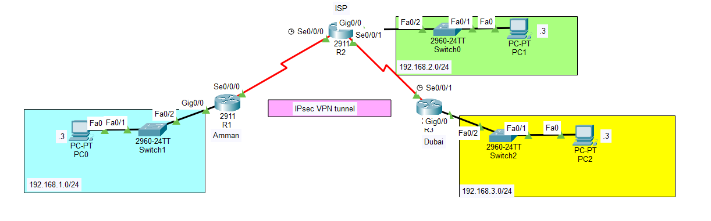

# 🔒 Site-to-Site IPsec VPN Configuration & Verification

This repository documents my successful implementation and verification of a site-to-site IPsec VPN tunnel, a critical project I undertook as part of a network security lab. My primary goal was to secure data transmission between two geographically separated LANs, simulating real-world secure enterprise connectivity.

The IPsec VPN tunnel connects my R1 (Amman) and R3 (Dubai) routers through an ISP-simulated router (R2), ensuring confidential and authenticated communication.

## 🎯 Key Objectives

* **🌐 Network Connectivity Verification:** I confirmed full connectivity between all network devices prior to VPN deployment.
* **🛠️ VPN Deployment on R1:** I configured and deployed the necessary IKE Phase 1 (ISAKMP) and Phase 2 (IPsec) parameters on router R1.
* **🔄 Reciprocating VPN Configuration on R3:** I implemented the reciprocating VPN parameters on router R3 to establish the secure tunnel.
* **✅ VPN Validation & Traffic Analysis:** I rigorously tested the VPN by creating "interesting" and "uninteresting" traffic and analyzing the `show crypto ipsec sa` output on R1 to confirm successful encryption and tunnel operation.

## 🗺️ Network Topology Overview

The network diagram below illustrates the physical and logical layout of my lab, including the designated subnets (`192.168.1.0/24` and `192.168.3.0/24`) and the flow of the secure IPsec tunnel.

***

***

## ⚙️ Configuration Details

For this project, I adhered to stringent cryptographic parameters to establish a robust and secure VPN tunnel:

### 🔐 IKE Phase 1 (ISAKMP) Policies
These parameters govern the initial negotiation and authentication between the VPN peers I configured.

| Parameters | R1 (Amman) | R3 (Dubai) |
| :--- | :--- | :--- |
| **Encryption Algorithm** | AES 256 | AES 256 |
| **Hash Algorithm** | SHA-1 | SHA-1 |
| **Authentication Method** | Pre-shared key | Pre-shared key |
| **Key Exchange (DH Group)** | Group 5 | Group 5 |
